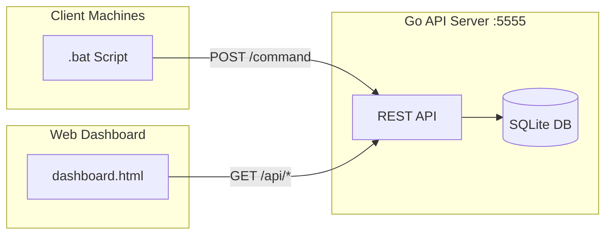

# File Report Server - Project Documentation

A Go-based API server with a web dashboard for collecting and visualizing file system reports from client machines.

---

## Project Structure

| File | Description |
|------|-------------|
| [server.go](file:///Users/bee/proj/go-api-server-ss/server.go) | Go backend with REST API |
| [dashboard.html](file:///Users/bee/proj/go-api-server-ss/dashboard.html) | Web dashboard UI |
| [report.bat](file:///Users/bee/proj/go-api-server-ss/report.bat) | Windows client script |
| `file_reports.db` | SQLite database |
| `go-api-server-ss` | Compiled binary |

---

## Windows Client Script (`report.bat`)

A Windows batch script that collects file system information from client machines and sends reports to the API server.

### Configuration

```batch
set SERVER_URL=http://localhost:5555/command
set BASE_PATH=C:\
```

> [!TIP]
> Change `SERVER_URL` to point to your actual server address when deploying.

### Features

- **Auto-detects** hostname and IP address
- **Scans directories** and counts files
- **Calculates sizes** in MB and GB
- **Sends JSON report** via HTTP POST using `curl`
- **Displays progress** and results in console

### Scanned Directories

| Directory | Description |
|-----------|-------------|
| `C:\Users` | User profiles and documents |
| `C:\Windows` | System files |
| `C:\Program Files` | Installed applications |

### Usage

```batch
# Run manually
report.bat

# Schedule with Task Scheduler for automated reports
```

### Output Example

```
╔════════════════════════════════════════╗
║   File Report Collector Started         ║
╚════════════════════════════════════════╝

Host: WORKSTATION-01
IP: 192.168.1.100
Base Path: C:\
Timestamp: 2026-02-02T20:00:00Z

Scan Results:
- C:\Users: 15000 files, 5120 MB
- C:\Windows: 85000 files, 10240 MB
- C:\Program Files: 25000 files, 20480 MB

Total: 125000 files, 35840 MB (35 GB)

Sending report to server...
✓ Report sent successfully!
```

### Requirements

- Windows OS
- `curl` command (included in Windows 10+)
- Network access to the API server

---

## Architecture Overview



---

## Data Models

### FileReport (Incoming Request)

```go
type FileReport struct {
    HostName    string      `json:"host_name"`
    HostIP      string      `json:"host_ip"`
    Timestamp   string      `json:"timestamp"`
    BasePath    string      `json:"base_path"`
    Directories []Directory `json:"directories"`
    Totals      Totals      `json:"totals"`
}
```

### Directory

```go
type Directory struct {
    Path      string `json:"path"`
    FileCount int    `json:"file_count"`
    SizeBytes int64  `json:"size_bytes"`
    SizeMB    int    `json:"size_mb"`
}
```

### Totals

```go
type Totals struct {
    TotalDirectories int   `json:"total_directories"`
    TotalFiles       int   `json:"total_files"`
    TotalSizeBytes   int64 `json:"total_size_bytes"`
    TotalSizeMB      int   `json:"total_size_mb"`
    TotalSizeGB      int   `json:"total_size_gb"`
}
```

### HostSummary (API Response)

```go
type HostSummary struct {
    HostName    string    `json:"host_name"`
    HostIP      string    `json:"host_ip"`
    LastReport  time.Time `json:"last_report"`
    TotalFiles  int       `json:"total_files"`
    TotalSizeMB int       `json:"total_size_mb"`
    TotalSizeGB int       `json:"total_size_gb"`
    ReportCount int       `json:"report_count"`
}
```

---

## Database Schema

### Table: `file_reports`

| Column | Type | Description |
|--------|------|-------------|
| `id` | INTEGER | Primary key (auto-increment) |
| `host_name` | TEXT | Hostname of reporting machine |
| `host_ip` | TEXT | IP address of reporting machine |
| `timestamp` | DATETIME | Report timestamp (default: current) |
| `base_path` | TEXT | Base directory path scanned |
| `total_directories` | INTEGER | Number of directories |
| `total_files` | INTEGER | Number of files |
| `total_size_bytes` | INTEGER | Total size in bytes |
| `total_size_mb` | INTEGER | Total size in MB |
| `total_size_gb` | INTEGER | Total size in GB |
| `report_data` | TEXT | Full JSON report |

### Table: `directory_details`

| Column | Type | Description |
|--------|------|-------------|
| `id` | INTEGER | Primary key (auto-increment) |
| `report_id` | INTEGER | Foreign key → file_reports.id |
| `path` | TEXT | Directory path |
| `file_count` | INTEGER | Files in directory |
| `size_bytes` | INTEGER | Directory size in bytes |
| `size_mb` | INTEGER | Directory size in MB |

### Indexes
- `idx_host_ip` on `file_reports(host_ip)`
- `idx_timestamp` on `file_reports(timestamp)`

---

## API Endpoints

### `POST /command`
**Purpose:** Receive file reports from client scripts.

**Request Body:**
```json
{
  "host_name": "WORKSTATION-01",
  "host_ip": "192.168.1.100",
  "timestamp": "2026-02-02 20:00:00",
  "base_path": "C:\\Users",
  "directories": [
    {"path": "C:\\Users\\Documents", "file_count": 150, "size_bytes": 52428800, "size_mb": 50}
  ],
  "totals": {
    "total_directories": 10,
    "total_files": 500,
    "total_size_bytes": 104857600,
    "total_size_mb": 100,
    "total_size_gb": 0
  }
}
```

**Response:**
```json
{
  "status": "success",
  "report_id": 123,
  "message": "File report saved successfully"
}
```

---

### `GET /api/hosts`
**Purpose:** Get summary of all hosts (latest report per host).

**Response:**
```json
[
  {
    "host_name": "WORKSTATION-01",
    "host_ip": "192.168.1.100",
    "last_report": "2026-02-02T20:00:00Z",
    "total_files": 500,
    "total_size_mb": 100,
    "total_size_gb": 0,
    "report_count": 5
  }
]
```

---

### `GET /api/host/reports?ip={ip}&limit={limit}`
**Purpose:** Get historical reports for a specific host.

| Parameter | Required | Default | Description |
|-----------|----------|---------|-------------|
| `ip` | Yes | - | Host IP address |
| `limit` | No | 50 | Max reports to return |

---

### `GET /api/report/details?id={id}`
**Purpose:** Get full report details including directory breakdown.

| Parameter | Required | Description |
|-----------|----------|-------------|
| `id` | Yes | Report ID |

---

### `GET /health`
**Purpose:** Health check endpoint.

**Response:**
```json
{
  "status": "healthy",
  "time": "2026-02-02T20:00:00+07:00",
  "database": "healthy"
}
```

---

### `GET /debug`
**Purpose:** Debug endpoint to view raw database records.

---

### `GET /`
**Purpose:** Serve the dashboard HTML.

---

## Dashboard Features

### Global Statistics
- Total Hosts
- Total Files
- Total Size (GB)
- Total Reports

### Host Cards
Each host displays:
- Hostname and IP
- Total files, size (MB/GB)
- Report count
- Last report timestamp
- Click to view detailed reports

### Modal Views
1. **Host Reports List:** View all reports for a host with timestamps
2. **Report Details:** Directory breakdown with file counts and sizes

### Auto-Refresh
Dashboard refreshes every 30 seconds.

---

## Server Configuration

```go
config.Port = "5555"
config.DBPath = "file_reports.db"
```

**CORS:** Enabled for all origins (`*`)

---

## Running the Server

```bash
# Build
go build -o go-api-server-ss

# Run
./go-api-server-ss
```

**Output:**
```
╔════════════════════════════════════════╗
║   File Report Server Started!             ║
╚════════════════════════════════════════╝

Server Port: 5555
Database: file_reports.db

Endpoints:
  Dashboard:  http://localhost:5555/
  API:        http://localhost:5555/command
  Health:     http://localhost:5555/health
```
