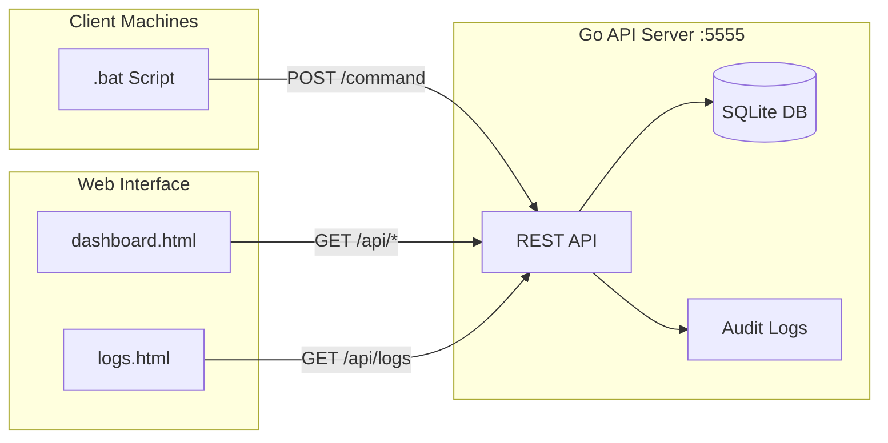

# File Report Server - Project Documentation

A Go-based API server with web dashboard and audit logging for collecting and visualizing file system reports from client machines.

---

## Project Structure

| File | Description |
|------|-------------|
| [server.go](file:///Users/bee/proj/go-api-server-ss/server.go) | Go backend with REST API and audit logging |
| [dashboard.html](file:///Users/bee/proj/go-api-server-ss/dashboard.html) | Main web dashboard UI |
| [logs.html](file:///Users/bee/proj/go-api-server-ss/logs.html) | Audit logs viewer |
| [report.bat](file:///Users/bee/proj/go-api-server-ss/report.bat) | Enhanced Windows client script |
| [dummy-test.sh](file:///Users/bee/proj/go-api-server-ss/dummy-test.sh) | Test script for development |
| `file_reports.db` | SQLite database |

---

## Windows Client Script (`report.bat`)

Enhanced Windows batch script with staging, logging, and configurable scanning.

### Configuration

```batch
set SERVER_URL=http://192.168.211.1:5555/command
set SCAN_PATH=C:\Users\User 46\Documents\New folder\screen-capturer
set CURL_DIR=C:\ss-check\
set DELETE_CURL_AFTER_RUN=1
set DELETE_LOGS_AFTER_RUN=0
```

### Features

- **Configurable scan path** - Target any directory
- **Curl staging** - Moves curl.exe to staging directory
- **Comprehensive logging** - Timestamped logs with levels
- **Cleanup options** - Configurable file cleanup
- **Test mode** - Run with `report.bat test`
- **Error handling** - Validates paths and dependencies
- **JSON generation** - Creates structured file reports

### Usage

```batch
# Normal run
report.bat

# Test mode (no server communication)
report.bat test
```

### Output Files (in CURL_DIR)

- `report.log` - Execution logs
- `file_report.json` - Generated report
- `dir_list.lst` - Directory listing
- `curl_output.out` - Server response

---

## Architecture Overview



---

## Data Models

### FileReport (Incoming Request)

```go
type FileReport struct {
    HostIP           string      `json:"host_ip"`
    Timestamp        string      `json:"timestamp"`
    BasePath         string      `json:"base_path"`
    Directories      []Directory `json:"directories"`
    TotalDirectories int         `json:"total_directories"`
}
```

### Directory

```go
type Directory struct {
    Path      string `json:"path"`
    FileCount int    `json:"file_count"`
    SizeBytes int64  `json:"size_bytes"`
    SizeMB    int    `json:"size_mb"`
}
```

### HostSummary (API Response)

```go
type HostSummary struct {
    HostName    string    `json:"host_name"`
    HostIP      string    `json:"host_ip"`
    LastReport  time.Time `json:"last_report"`
    TotalFiles  int       `json:"total_files"`
    TotalSizeMB int       `json:"total_size_mb"`
    TotalSizeGB float64   `json:"total_size_gb"`
    ReportCount int       `json:"report_count"`
}
```

---

## Database Schema

### Table: `file_reports`

| Column | Type | Description |
|--------|------|-------------|
| `id` | INTEGER | Primary key (auto-increment) |
| `host_ip` | TEXT | IP address of reporting machine |
| `timestamp` | DATETIME | Report timestamp (default: current) |
| `base_path` | TEXT | Base directory path scanned |
| `total_directories` | INTEGER | Number of directories |
| `report_data` | TEXT | Full JSON report |

**Unique constraint:** `(host_ip, timestamp)`

### Table: `directory_details`

| Column | Type | Description |
|--------|------|-------------|
| `id` | INTEGER | Primary key (auto-increment) |
| `report_id` | INTEGER | Foreign key → file_reports.id |
| `path` | TEXT | Directory path |
| `file_count` | INTEGER | Files in directory |
| `size_bytes` | INTEGER | Directory size in bytes |
| `size_mb` | INTEGER | Directory size in MB |

### Table: `audit_logs`

| Column | Type | Description |
|--------|------|-------------|
| `id` | INTEGER | Primary key (auto-increment) |
| `created_at` | DATETIME | Log timestamp (default: current) |
| `host_ip` | TEXT | Source IP address |
| `action` | TEXT | Action performed |
| `status` | TEXT | Status (success/error/warning) |
| `message` | TEXT | Log message |
| `details` | TEXT | Additional details |

### Indexes
- `idx_host_ip` on `file_reports(host_ip)`
- `idx_timestamp` on `file_reports(timestamp)`
- `idx_audit_host` on `audit_logs(host_ip)`
- `idx_audit_date` on `audit_logs(created_at)`

---

## API Endpoints

### `POST /command`
**Purpose:** Receive file reports from client scripts with audit logging.

**Request Body:**
```json
{
  "host_ip": "192.168.1.100",
  "timestamp": "2026-02-03 21:35:40",
  "base_path": "C:\\Users\\Documents",
  "directories": [
    {"path": "C:\\Users\\Documents\\folder1", "file_count": 150, "size_bytes": 52428800, "size_mb": 50}
  ],
  "total_directories": 10
}
```

**Response:**
```json
{
  "status": "success",
  "report_id": 123,
  "message": "File report saved successfully"
}
```

---

### `GET /api/hosts`
**Purpose:** Get summary of all hosts (latest report per host).

**Response:**
```json
[
  {
    "host_name": "WORKSTATION-01",
    "host_ip": "192.168.1.100",
    "last_report": "2026-02-03T21:35:40Z",
    "total_files": 500,
    "total_size_mb": 100,
    "total_size_gb": 0.1,
    "report_count": 5
  }
]
```

---

### `GET /api/host/reports?ip={ip}&limit={limit}`
**Purpose:** Get historical reports for a specific host.

| Parameter | Required | Default | Description |
|-----------|----------|---------|-------------|
| `ip` | Yes | - | Host IP address |
| `limit` | No | 50 | Max reports to return |

---

### `GET /api/report/details?id={id}`
**Purpose:** Get full report details including directory breakdown.

---

### `GET /api/logs?host_ip={ip}&status={status}&limit={limit}&offset={offset}`
**Purpose:** Get audit logs with filtering options.

| Parameter | Required | Default | Description |
|-----------|----------|---------|-------------|
| `host_ip` | No | - | Filter by host IP |
| `status` | No | - | Filter by status |
| `limit` | No | 100 | Max logs to return |
| `offset` | No | 0 | Pagination offset |

---

### `GET /health`
**Purpose:** Health check endpoint.

**Response:**
```json
{
  "status": "healthy",
  "time": "2026-02-03T21:35:40+07:00",
  "database": "healthy"
}
```

---

### `GET /debug`
**Purpose:** Debug endpoint to view raw database records.

---

### `GET /`
**Purpose:** Serve the main dashboard.

---

### `GET /logs`
**Purpose:** Serve the audit logs viewer.

---

## Web Interface

### Main Dashboard (`/`)
- **Global Statistics:** Total hosts, files, size, reports
- **Host Cards:** Individual host summaries with click-to-expand
- **Modal Views:** Host reports list and detailed report breakdown
- **Auto-refresh:** Updates every 30 seconds
- **Navigation:** Link to logs viewer

### Logs Viewer (`/logs`)
- **Filtering:** By host IP, status, date range
- **Pagination:** Configurable page size
- **Export:** CSV download functionality
- **Real-time:** Manual refresh and auto-refresh options
- **Status Colors:** Visual status indicators

---

## Dependencies

```go
require modernc.org/sqlite v1.44.3
```

**Go Version:** 1.25.6

---

## Server Configuration

```go
config.Port = "5555"
config.DBPath = "file_reports.db"
```

**CORS:** Enabled for all origins (`*`)

---

## Running the Server

```bash
# Build
go build -o go-api-server-ss

# Run
./go-api-server-ss
```

**Output:**
```
╔════════════════════════════════════════╗
║   File Report Server Started!          ║
╚════════════════════════════════════════╝

Server Port: 5555
Database: file_reports.db

Endpoints:
  Dashboard:  http://localhost:5555/
  Logs:       http://localhost:5555/logs
  API:        http://localhost:5555/command
  Health:     http://localhost:5555/health
```

---

## Development

### Test Script
Use `dummy-test.sh` for development testing:

```bash
./dummy-test.sh
```

### Database Inspection
Access debug endpoint for raw data:
```
http://localhost:5555/debug
```
